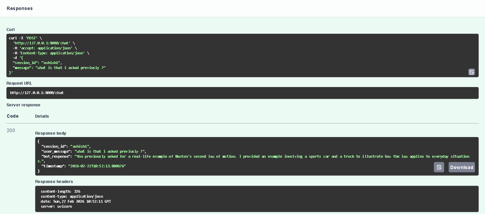
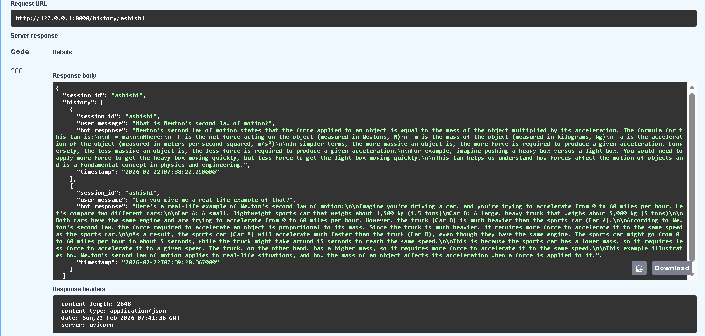

# 📚 Study Bot --- AI Powered Study Assistant

An AI-powered chatbot API that answers study-related questions and
maintains conversation memory using MongoDB.

🔗 **Live API Documentation:**\
https://study-bot-bs6x.onrender.com/docs

------------------------------------------------------------------------

## 🚀 Project Overview

Study Bot is a REST API built using **FastAPI** that integrates a Large
Language Model (LLM) via **LangChain + Groq**.\
It stores conversation history in **MongoDB Atlas** to provide
context-aware responses across sessions.

This project demonstrates:

-   LLM API integration
-   Context-aware memory handling
-   RESTful API architecture
-   Cloud deployment on Render

------------------------------------------------------------------------

## ✨ Key Features

-   🤖 AI-powered academic chatbot
-   🧠 Session-based memory using MongoDB
-   📡 REST API endpoints
-   🔄 Retrieve & delete chat history
-   ☁️ Publicly deployed and accessible

------------------------------------------------------------------------

## 🛠 Tech Stack

  Category          Technology
  ----------------- ------------------
  Language          Python 3.11
  Framework         FastAPI
  Server            Uvicorn
  LLM Integration   LangChain + Groq
  Database          MongoDB Atlas
  Deployment        Render

------------------------------------------------------------------------

## 📁 Project Structure

    study-bot/
    │
    ├── app.py
    ├── requirements.txt
    ├── runtime.txt
    ├── README.md
    ├── .gitignore
    └── screenshots/
        ├── Study Bot UI.png
        ├── Response.png
        └── History.png

------------------------------------------------------------------------

## ⚙️ How To Run Locally

1️⃣ Clone the repository

``` bash
git clone https://github.com/AshishCherian15/study-bot.git
cd study-bot
```

2️⃣ Create virtual environment

``` bash
python -m venv venv
venv\Scripts\activate   # Windows
```

3️⃣ Install dependencies

``` bash
pip install -r requirements.txt
```

4️⃣ Create a `.env` file and add:

    GROQ_API_KEY=your_groq_api_key
    MONGO_URI=your_mongodb_connection_string

5️⃣ Start the server

``` bash
uvicorn app:app --reload
```

Open in browser: http://localhost:8000/docs

------------------------------------------------------------------------

## 📡 API Endpoints

  Method   Endpoint                  Description
  -------- ------------------------- -------------------------
  GET      `/`                       Health check
  POST     `/chat`                   Send message to chatbot
  GET      `/history/{session_id}`   Retrieve chat history
  DELETE   `/history/{session_id}`   Clear chat history

------------------------------------------------------------------------

## 🧪 Example API Request

``` json
POST /chat
{
  "session_id": "student123",
  "message": "Explain Newton's second law"
}
```

------------------------------------------------------------------------

# 📸 Screenshots

## 1️⃣ API Documentation Interface (Swagger UI)

Displays all available endpoints including `/chat`, `/history`, and root
health check.


------------------------------------------------------------------------

## 2️⃣ Chat Response Example

Shows how the chatbot responds to user queries with contextual answers.



------------------------------------------------------------------------

## 3️⃣ Stored Chat History

Demonstrates MongoDB-backed session memory where previous conversations
are retrieved.



------------------------------------------------------------------------

## 🔐 Environment Variables

The following environment variables are required:

    GROQ_API_KEY
    MONGO_URI

⚠️ Do NOT commit your `.env` file to GitHub.

------------------------------------------------------------------------

## 📌 Notes

-   MongoDB Atlas must allow network access.
-   Ensure environment variables are set in Render.
-   API documentation available at `/docs`.

------------------------------------------------------------------------

## 📄 License

This project is for educational and demonstration purposes.
