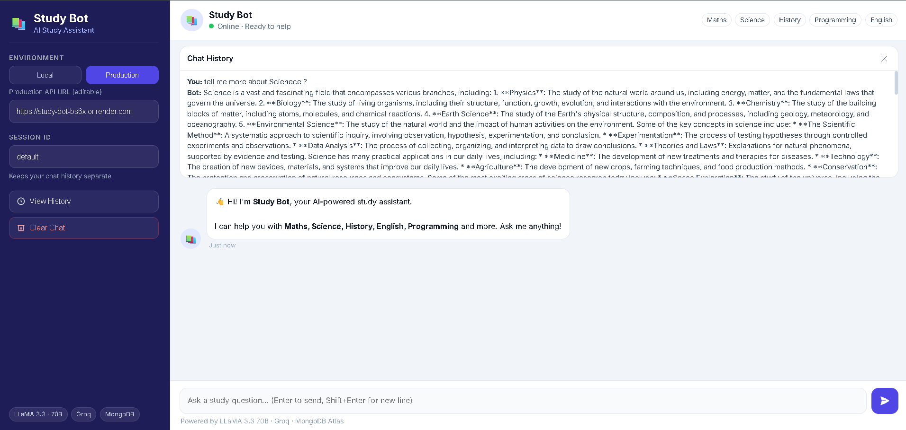

# 📚 Study Bot — AI Study Assistant


An AI-powered Study Assistant that answers academic questions and remembers conversation history by session.

## 🔗 Live Links
- Frontend: https://study-bot-seven.vercel.app/
- Backend Docs: https://study-bot-bs6x.onrender.com/docs

## ✨ Features
- AI answers for study topics (Maths, Science, History, English, Programming)
- Session-based chat memory with MongoDB Atlas
- Modern chat UI with Local/Production mode switch
- View previous history by session ID
- Clear chat conversation instantly
- FastAPI backend with Swagger docs

## 🧱 Architecture
- **Frontend:** Static web app (`frontend/`) deployed on Vercel
- **Backend:** FastAPI API (`app.py`) deployed on Render
- **LLM:** Groq (LLaMA 3.3 70B)
- **Database:** MongoDB Atlas

## 📁 Project Structure
```
study-bot/
├── app.py
├── requirements.txt
├── runtime.txt
├── gitignore
├── README.md
├── frontend/
│   ├── index.html
│   ├── styles.css
│   └── app.js
└── screenshots/
  └── image.png
```

## ⚙️ Local Setup
1. Clone repo
```bash
git clone https://github.com/AshishCherian15/study-bot.git
cd study-bot
```

2. Create and activate env
```bash
python -m venv venv
venv\Scripts\activate
```

3. Install dependencies
```bash
pip install -r requirements.txt
```

4. Create `.env` (or `env`) file
```env
GROQ_API_KEY=your_groq_api_key
MONGO_URI=your_mongodb_connection_string
FRONTEND_ORIGINS=http://127.0.0.1:5500
```

5. Start backend
```bash
uvicorn app:app --reload --host 127.0.0.1 --port 8000
```

6. Open frontend
- Open `frontend/index.html` via VS Code Live Server (e.g., `127.0.0.1:5500`)
- Keep Environment = `Local` in sidebar

## 🚀 Deployment

### Vercel (Frontend)
- Import repository in Vercel
- Set **Root Directory** = `frontend`
- Framework = `Other`
- Deploy

### Render (Backend)
- Build command: `pip install -r requirements.txt`
- Start command: `uvicorn app:app --host 0.0.0.0 --port $PORT`
- Required env vars:
  - `GROQ_API_KEY`
  - `MONGO_URI`
  - `FRONTEND_ORIGINS=https://study-bot-seven.vercel.app`

## 📡 API Endpoints
- `GET /` — Health check
- `POST /chat` — Send message to Study Bot
- `GET /history/{session_id}` — Get session history
- `DELETE /history/{session_id}` — Clear session history

## 🧪 Example Request
```json
{
  "session_id": "student123",
  "message": "Explain Newton's second law"
}
```

## 📸 Screenshots
- Frontend UI



## 🔐 Security Notes
- Never commit real API keys
- Rotate keys immediately if leaked
- Keep local secrets only in `.env` / `env`

## 📄 License
Educational and demonstration use.
